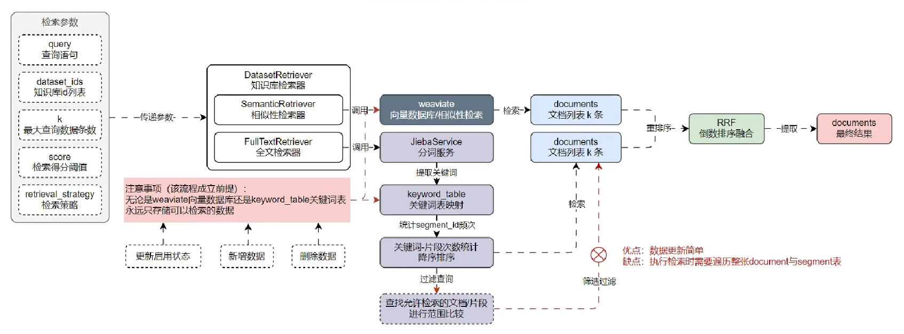
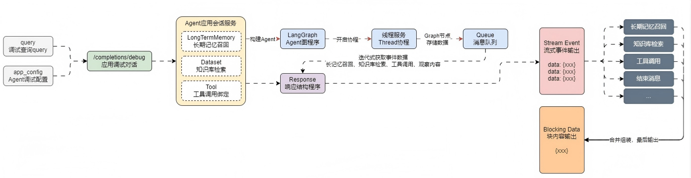
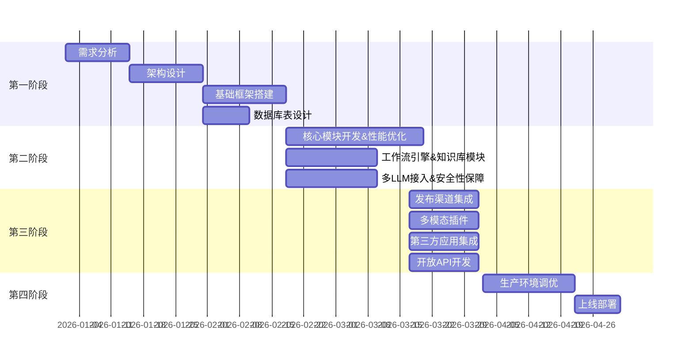

<h1 align="center">Aether LLMOps 原生AI 应用开发平台</h1>


## Aether LLMOps 项目服务架构设计

在整个Aether LLMOps项目中，我使用了多个服务，具体如下：

1. API：基于`Flask`和`LangChain`搭建的 `LLMOps API` 服务。
2. Web：基于`Vue.js`搭建的 `LLMOps`前端服务，一个静态`html`文件服务。
3. 数据库：`Postgres`数据库，用于存储`LLMOps`项目的数据信息。
4. 缓存：`Redis`缓存数据库，用于存储`Embeddings`缓存、`Celery`消息代理等信息。
5. 向量数据库：`Weaviate`向量数据库，用于存储`Embeddings`向量。
6. 任务队列：`Celery`任务队列，用于执行异步任务。
7. Nginx反向代理：反向代理连接`API`和`WEB`服务，实现域名访问 `LLMOps` 项目。

为了便于部署和管理，我将这些服务部署到`Docker`容器中，并使用`docker-compose`管理多个容
器，同时通过 `Nginx` 进行反向代理，连接 `API` 和 `web` 服务，项目整体服务架构设计图如下：


## 快速开始

填写`docker-compose.yml`文件中的环境变量，包括数据库连接信息、缓存数据库连接信息、向量数据库连接信息，各种API密钥等。

```bash
cd docker
docker-compose up -d
```

## 知识库模块

### 一些优化点

- 考虑到处理大量文档分块、嵌入等的长耗时，利用 Celery+Redis 构建异步任务队列处理分块嵌入，用线程池优化向量入库。
- 随着功能迭代，针对检索准确率不够，在 RAG 引入检索前处理+混合检索+重排，在《》数据下测试，准确率相比语义检索提升30%+，召回率从60%提升至83%+。
- 在文档与片段(chunk)的更新与删除时，实现 Redis 缓存锁，保障数据安全。

### 检索器设计思路

- 在全文检索时，项目考虑的是第一种方案，增删改都要将数据同步到关键词表中，简化全文检索的实现。
- 第二种方法，本项目并未使用，因为其在全文检索时，需要将所有 doc 和 seg 都遍历一遍再过滤，导致查询效率低。



## 流式输出

考虑在`LLMOps`项目中，借用`队列(Queue)+线程(Thread)`的方式来重新实现流式输出这个逻辑，思路如下：

构建一个 队列(Queue)，用于存储数据，队列的数据先进先出，并且是线程安全的，非常适合用于开发。
在`LangGraph`构建的节点(nodes)中，所有代码都使用`stream()` 代替`invoke()`，获取数据的时候，将数据添加到队列(Queue) 中。
创建一条线程，专门用于执行`LangGraph`图程序，这样不影响主线程。
在主线程监听队列(Queue)里的数据，并逐个取出，然后进行流式事件响应输出，直到取到结果为`None`结束请求。
基于该思想，在`LLMOps`项目中实现`流式事件响应 + 块内容响应`的两种输出响应运行流程如下：



## 项目时间节点



## 附录

### 术语表

| 术语 | 定义                                            |
| ---- | ----------------------------------------------- |
| LLM  | Large Language Model，大语言模型                |
| RAG  | Retrieval-Augmented Generation，检索增强生成    |
| API  | Application Programming Interface，应用程序接口 |

## 贡献

贡献是使开源社区成为学习、激励和创造的惊人之处。非常感谢您所做的任何贡献。如果您有任何建议或功能请求，请先开启一个议题讨论您想要改变的内容。

## 许可证

该项目根据 Apache-2.0 许可证的条款进行许可。详情请参见[LICENSE](LICENSE)文件。
