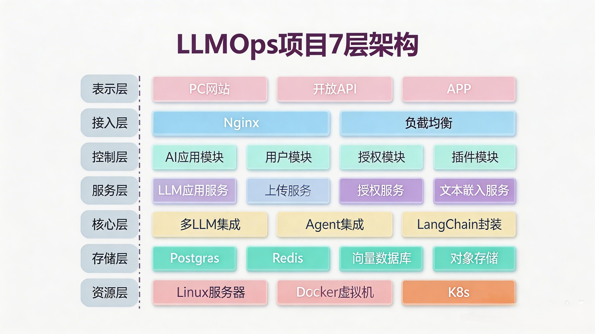
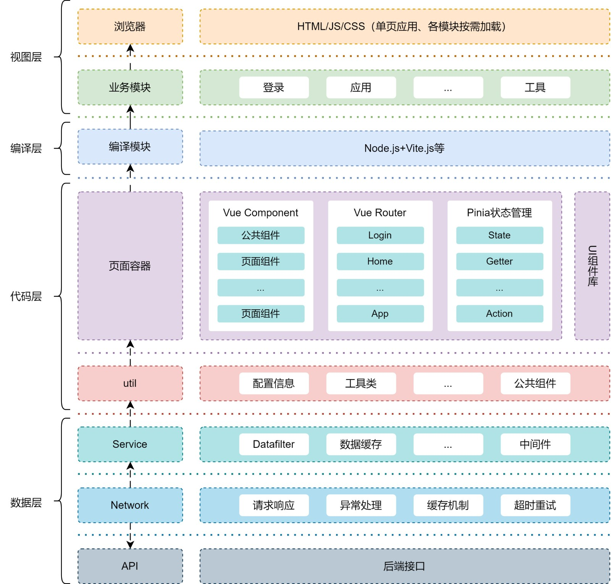
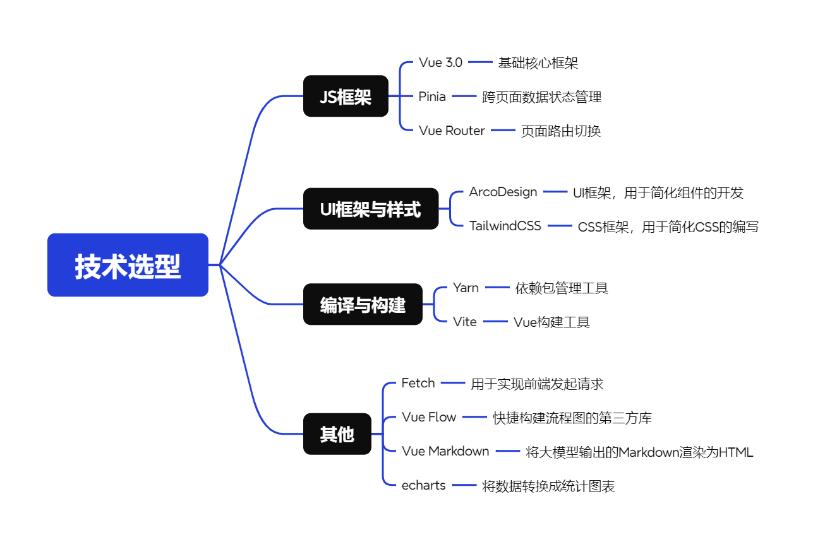

# AetherLLMOps


## AetherLLMOps架构



**文件组织方式**：

```Plain Text
|---app  // 应用入口集合
|   ├---__init__.py
|   └---http
|---config  // 应用配置文件
|   ├---__init__.py
|   ├---config.py
|   └---default_config.py
|---internal  // 应用所有内部文件夹
|   ├---core  // LLM核心文件，集成LangChain、LLM、Embedding等非逻辑的代码
|   |   |---agent
|   |   |---chain
|   |   |---prompt
|   |   |---model_runtime
|   |   |---moderation
|   |   |---tool
|   |   |---vector_store
|   |   └---...
|   ├---exception  // 通用公共异常目录
|   |   ├---__init__.py
|   |   ├---exception.py
|   |   └---...
|   ├---extension  // Flask扩展文件目录
|   |   ├---__init__.py
|   |   ├---database_extension.py
|   |   └---...
|   ├---handler  // 路由处理器、控制器目录
|   |   ├---__init__.py
|   |   ├---account_handler.py
|   |   └---...
|   ├---middleware  // 应用中间件目录，包含校验是否登录
|   |   ├---__init__.py
|   |   └---middleware.py
|   |   └---...
|   ├---migration  // 数据库迁移文件目录，自动生成
|   |   ├---versions
|   |   └---...
|   ├---model  // 数据库模型文件目录
|   |   ├---__init__.py
|   |   ├---account.py
|   |   └---...
|   ├---router  // 应用路由文件夹，https://baidu.com/abc?q=123&name=泽辉
|   |   ├---__init__.py
|   |   ├---router.py
|   |   └---...
|   ├---schedule  // 调度任务、定时任务文件夹
|   |   ├---__init__.py
|   |   └---...
|   ├---schema  // 请求和响应的结构体
|   |   ├---__init__.py
|   |   └---...
|   ├---server  // 构建的应用，与app文件夹对应
|   |   ├---__init__.py
|   |   └---...
|   ├---service // 服务层文件夹
|   |   ├---__init__.py
|   |   ├---oauth_service.py
|   |   └---...
|   ├---task  // 任务文件夹，支持即时任务+延迟任务
|   |   ├---__init__.py
|   |   └---...
|---pkg  // 扩展包文件夹
|   ├---__init__.py
|   |---oauth
|   |   ├---__init__.py
|   |   ├---github_oauth.py
|   |   └---...
|   └---...
├---storage  // 本地存储文件夹
├---test  // 测试目录
├---venv  // 虚拟环境
├---.env  // 应用配置文件
├---.gitignore  // 配置git忽略文件
├---requirements.txt  // 第三方包依赖管理
└---README.md  // 项目说明文件
```

## 起动项目

1. 安装依赖
```bash
pip install -r requirements.txt
```
2. 配置环境变量
   - 复制`.env.example`文件为`.env`
   - 填写OpenAI API密钥和其他必要的配置
```bash
cp .env.example .env
```
3. 启动项目
```bash
python -m flask run
```


## 项目前端架构与基础框架选择
### 项目前端架构
LLMOps 项目的前端部分包含了 视图层、编译层、代码层和数据层  4 个部分。
1. 视图层 ：涵盖浏览器和业务模块，主要功能是将用户选择的 web 资源，通过解析网页源文件进行显示，并展示出不同的模块。
2. 编译层 ：编译层分析项目结构，根据入口文件找到 JavaScript 模块及其它浏览器不能直接运行的拓展语言（如TypeScript、SCSS等），通过 Vite 将源代码编译成适合浏览器使用的格式。
3. 代码层 ：在代码层，每个独立的可视或可交互区域都视为一个组件，并将所需的各种资源集中在组件目录下维护。Vue-router用于页面路径和组件的映射，Pinia 集中管理应用状态，UI组件库提高界面设计效率，util 文件夹则管理全局工具。
4. 数据层 ：数据层包括Service模块，负责业务逻辑的独立性和重用性；Network模块，查看网络请求的内容；以及 Api 模块，通过 fetch 请求从后端接口获取所需数据。
项目技术架构图如下：

### 项目技术选型   
选定一个前端框架时，我们需要考虑的因素有：
- 框架是否能满足大部分应用的需求？如果不能，那么需要使用哪个框架？
- 框架是否有丰富的组件库？如果没有，我们的团队和组织是否有独立开发的能力？
- 框架的社区支持怎样？在遇到问题时能否快速方便地找到人解答？
- 框架的替换成本如何？假如我们的新项目将使用B框架，那么我们还需要额外学习什么内容？
目前市面上的三大前端框架 Angular、React、Vue，为什么选择 Vue 作为最基础的框架？
1. React ：React 只是一个 View 层的框架，为了完成一个完整的应用，还需要使用 路由库、执行单向流库、webAPI调用库、测试库、依赖管理、编译构建配置 等，要搭建一个完整的 React 功能，需要做大量的额外工作，需要单独学习 JSX 模板语法。
2. Angular ：一个大而全的框架，提供了开发应用所需的脚手架，包含测试、运行服务、打包等部分，但是上手成本高，框架限制高，对新手不友好，国内企业使用得比较少，并且于 2022 年已经停止维护。
3. Vue ：对于没有 Angular 和 React 经验的团队来说，Vue 是一个非常好的选择。Vue 借鉴了 Angular 和 React 的一些思想，在其基础上开发了一套更易上手的框架。Vue 的开发者尤雨溪是中国人，框架本身提供了 大量丰富的中文文档 ，这也为 Vue 的发展和使用带来巨大的优势。



## 贡献
贡献是使开源社区成为学习、激励和创造的惊人之处。非常感谢你所做的任何贡献。如果你有任何建议或功能请求，请先开启一个议题讨论你想要改变的内容。

## 许可证

该项目根据Apache-2.0许可证的条款进行许可。详情请参见[LICENSE](LICENSE)文件。